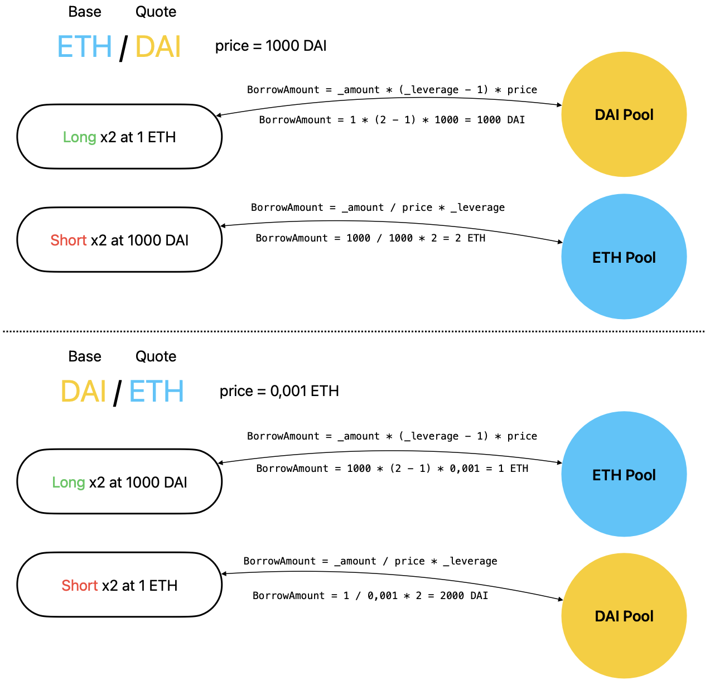
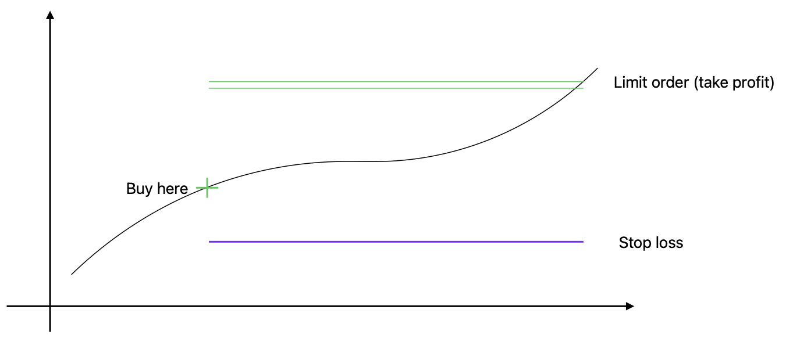
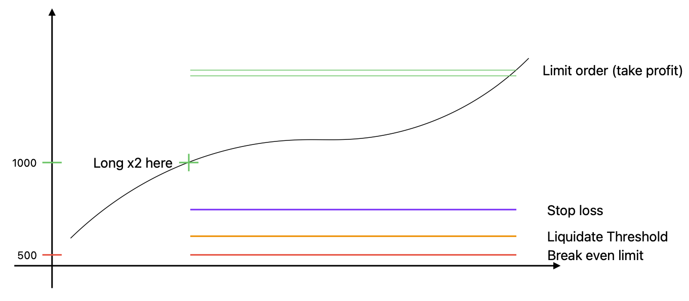
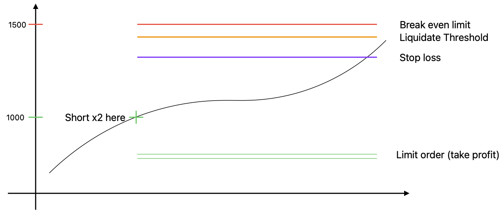

# Eswap Margin contracts

## Requirements

Please install the following:

-   [Git](https://git-scm.com/book/en/v2/Getting-Started-Installing-Git)
    -   You'll know you've done it right if you can run `git --version`
-   [Foundry / Foundryup](https://github.com/gakonst/foundry)
    -   This will install `forge`, `cast`, and `anvil`
    -   You can test you've installed them right by running `forge --version` and get an output like: `forge 0.2.0 (f016135 2022-07-04T00:15:02.930499Z)`
    -   To get the latest of each, just run `foundryup`

And you probably already have `make` installed... but if not [try looking here.](https://askubuntu.com/questions/161104/how-do-i-install-make)

## Setup

You'll need to add the following variables to a `.env` file:

-   `ETH_RPC_URL`: A URL to connect fork the mainnet.
-   `PRIVATE_KEY`: A private key from your wallet. You can get a private key from a new [Metamask](https://metamask.io/) account
-   Optional `ETHERSCAN_API_KEY`: If you want to verify on etherscan

# Resources

-   [Chainlink Documentation](https://docs.chain.link/)
-   [Foundry Documentation](https://book.getfoundry.sh/)

## ---------------------------------------------

# Abstract

Eswap is Built to give users 0% interest rate leverage and short selling in the spot market on top of deep liquidity which eliminate the first problem that a DEX can have  When building a decentralized exchange, the hardest part is attracting liquidity. Every cutting-edge, little-known DEX has liquidity problems that put them in a vicious cycle: No users → No liquidity → No transaction volume → No reputation → So no liquidity →  no users.

DeFi's composability makes it possible to benefit from the liquidity of other protocols.

Eswap margin aims to end funding fees. By leveraging Chainlink price feeds, we supercharged Uniswap V3 by implementing Professionnal trading tools on top of it that enables a leverage trading with 0% interest rate making Eswap a Pionner to enable traders to trade the alpha not the clock:

- Limit Order
- Stop Loss
- Margin trading
    - Long / Short
    - Leverage

### What’s new for traders with Eswap Margin ?

Our protocol architecture allows margin trading on any asset that has a XXX/ETH Chainlink price feed.

For example, someone can open a 5x short position on WBTC/MATIC with a stop loss and a limit order (take profit).

The trader can basically create the margin product of his dreams. This makes Eswap Max quite unique and attractive when someone wants to trade with professionnal tools while eliminating the interest rate that eats your profit.

Eswap will be deployed on TON and all EVM blockchains in BNB, BNB Chain, BSC, BNB Smart Chain, opBNB, Greenfield,Ethereum,Polygon,Optimism,Blast,Base,Arbitrum,Avalanche,Linea,Cronos,Mantle,Scroll

# Tech Stack

## Smart Contracts

We used the [foundry](https://github.com/smartcontractkit/foundry-starter-kit) framework and deploying on an Uniswap V3 compatible chain.

| Contract name | Description | Fork/Inspiration/Library |
| --- | --- | --- |
| Positions.sol | Positions recorder/main contract | [OZ ERC721](https://github.com/OpenZeppelin/openzeppelin-contracts/blob/master/contracts/token/ERC721/ERC721.sol) |
| Market.sol | Global protocol interface | - |
| LiquidityPool.sol | Liquidity pool for leverage and short position one liquidity pool for each token | [Solmate ERC4626](https://github.com/transmissions11/solmate/blob/main/src/mixins/ERC4626.sol) |
| LiquidityPoolFactory.sol | Interface the create LiquidityPoolXXX | - |
| PriceFeed.sol | The price feed | [Chainlink data feed](https://docs.chain.link/data-feeds/#price-feeds) |
| UniswapV3Helper.sol | Helper for managing liquidity and swap on Uniswap | [Uniswap Doc](https://github.com/stakewithus/defi-by-example/tree/main/uni-v3/contracts) |

### Positions

The `Positions.sol` contract is the main contract and is owned by the `Market.sol` contract. The user is able to personalize his position with stop loss, limit order and/or margin trading (short, leverage). For example, this composability allows to create a leveraged short with a take profit and a stop loss.

The user receive an NFT representing his position.

### Liquidations

For a leveraged position, we need to be sure that the position will be liquidated before the breakeven limit, so we decided to rely on a fixed fee that will recapitalize the protocol acting as an insurance for the vaults, which is taken from the trader when the position is opened, and then given to the liquidator when the position is liquidated.

For each margin position there will be a spread between the break-even price and the liquidation price. Through this really simple mechanism, liquidators are helping the protocol to remain solvent.

This reward is taken from the trader's initial deposit and returned if the liquidation doesn't occur.

A position is liquidable when :

- This Limit Order is reached
- The Stop Loss is reached
- The liquidation price is crossed (acts like an automatic stop loss. Only for margin trading positions)

### Liquidity providers

`LiquidityPoolXXX.sol` Liquidity providers are incentivized to trade with 0% interest rate leverage, benefiting from the same professional tools as traders. 

### Market

The `Market.sol` contract will be the only entry point for all entities:

- The **Trader** : will be able to **open**, **close** and **edit** his positions.
- The **Liquidity provider** : will be allowed to provide liquidity.
- The *Liquidator*: will be able to liquidate the trader's position for a fee that will recapitalize the protocol acting as an insurance to all of the users.
- The **Admin** : will be able to create a new pool

## Frontend

- [NextJS](https://nextjs.org/)
- [Vercel](https://vercel.com/) for hosting
- [RainbowKit](https://www.rainbowkit.com/) to handle the browser wallet
- [Trading](https://www.tradingview.com/tradingview-for-the-web/) view API to visualize graphics

# How it works

By leveraging the Chainlink price feed, we will supercharge Uniswap V3 by implementing Professionnal trading tools on top of the protocol:

- Limit Order
- Stop Loss
- Margin trading
    - Long / Short
    - Leverage

### Limit Order

Create a liquidity position that can be liquidated when the position crosses from one asset to another.

### Stop Loss

Sell the market when the stop price is triggered.

### Market Order (Classic Swap)

Redirect to the Eswap interface.

### Leveraged Position (Long/Short)

In order to offer margin trading, we need to create pools that allow anyone to provide liquidity.

The protocol manages liquidation to stay solvent.

The user open a long position by sending the base token and open a short position by sending the quote token. (see figure below)

When longing, we need to borrow the quote token from liquidityPool

When shorting, we need to borrow the base token from liquidityPool

# The oracle

We leveraged the Chainlink price feed to effectively monitor position collateralization. To ensure seamless trading on Eswap Margin, we establish our own reliable price feed for custom pairs by using XXX/ETH chainlink price feed. This approach mandates the existence of a corresponding Chainlink price feed (XXX/ETH) for both tokens within the trading pair.

By integrating the Chainlink price feed, we gain access to accurate and up-to-date market prices, which are crucial for determining the collateralization status of positions.

Here are some points to mitigate this problem:

- Uniswap is the most liquid DEX. We can expect the price to be close to the market average.
- For margin trading, we will focus on high liquidity asset in the first place.
- Since the liquidation reward is a fixed fee, the liquidator will be incentivized to close the position as soon as the position becomes potentially a creator of bad debt.
- If it's not enough, unfortunately someone will have to take the loss and it will be the liquidity pool.

# Position examples

Note that it’s not mandatory to configure a **stop loss** or a **limit order**. Traders can customize their trade as they wish. Some example below:

## The classic buy position

## Leveraged x2 long

## Leveraged x2 short

# References

### Helper

https://www.openzeppelin.com/contracts

https://github.com/transmissions11/solmate/blob/main/src/mixins/ERC4626.sol

https://www.rainbowkit.com/

### Uniswap

https://uniswap.org/whitepaper-v3.pdf

https://docs.uniswap.org/contracts/v3/guides/providing-liquidity/the-full-contract

https://docs.uniswap.org/contracts/v3/guides/swaps/single-swaps

